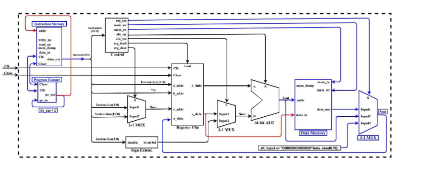
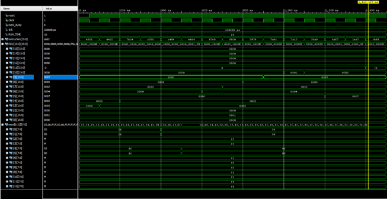

<h1 align = "center"> 16 BIT CPU DESIGN </h1>
 

<h2><b>Description</b></h2>

A fully implemented CPU capable of executing various instruction types, including i-type, r-type, and j-type instructions, each encoded within a 16-bit format. The CPU efficiently performs functions such as loading words (load word) and storing words (store word), effectively managing data within its memory subsystem. Through meticulous design and implementation, the CPU seamlessly integrates these functionalities, enabling robust execution of complex programs and operations.

 

<h2 align = "center">List of Instructions Executed</h2>

<table align = "center">
<tr>
  <td><b>Instruction </b></td>
  <td><b>op </b></td>
  <td><b>rd </b></td>
  <td><b>rs</b></td>
  <td><b>rt / immediate </b></td>
  <td><b>Value</b></td>
</tr>

<tr>
  <td> ADDI R3,R0,5</td>
  <td>4</td>
   <td>3</td>
   <td>0</td>
   <td>5</td>
   <td>5</td>
</tr>

<tr>
  <td> SLT R4,R3,R4</td>
   <td>7</td>
   <td>b</td>
   <td>3</td>
   <td>4</td>
   <td>0</td>
</tr>

<tr>
  <td> SW R3, 0(R0)</td>
   <td>c</td>
   <td>3</td>
   <td>0</td>
   <td>0</td>
   <td>5</td>
</tr>

<tr>
  <td> LW R7, 0(R6)</td>
   <td>8</td>
   <td>7</td>
   <td>6</td>
   <td>0</td>
   <td>2</td>
</tr>

<tr>
  <td> SUBI R10, R5, 7</td>
   <td>5</td>
   <td>a</td>
   <td>5</td>
   <td>7</td>
   <td>0</td>
</tr>
</table>

 
<h2 align = "center" >
  Top Module Design 
   
  
</h1>

 
<h2 align = "center">
  Verification of Outputs (Waveform)
   
  
</h1>

